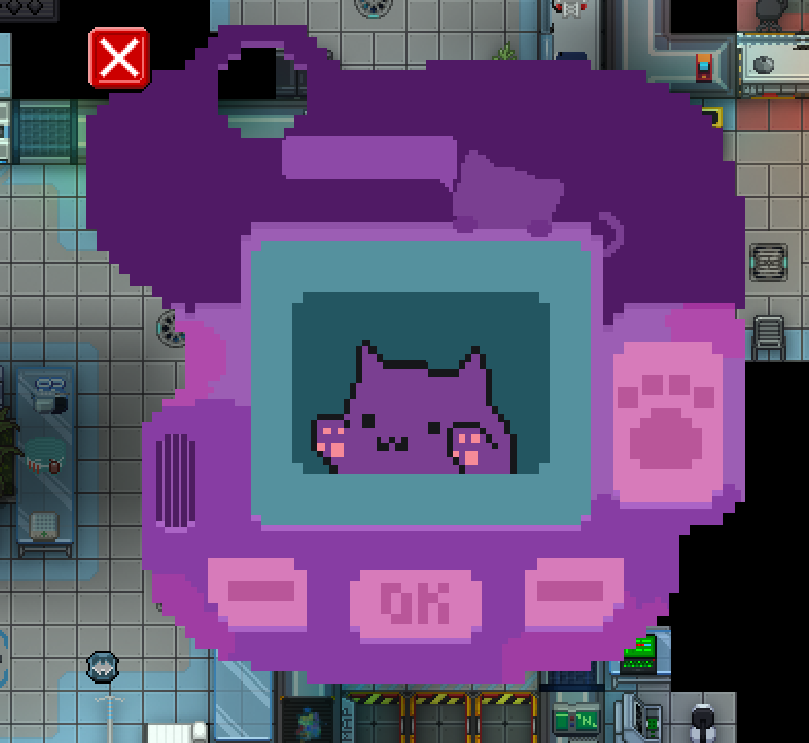

# How to make a MindUI: Easy Version
To note, this is not the best way but the easiest way, the best way is only slightly different but involves manually offsetting each element.

## Step 1: Draw the UI

I used Asprite for this, but the key is to make each element its own layer.
## Step 2: Export each layer as a PNG
Since it was drawn in layers exporting each layer as a png means its properly seperated if you need a script for Asprite I can provide this.
## Step 3: Import into a DMI file

## Step 4: Do the basic code
```
/datum/mind_ui/tamogatchi
	uniqueID = "Tamogatchi"
	element_types_to_spawn = list(
		/obj/abstract/mind_ui_element/tamogatchi_background,
		/obj/abstract/mind_ui_element/tamogatchi_screen,
		/obj/abstract/mind_ui_element/tamogatchi,
		/obj/abstract/mind_ui_element/hoverable/tamogatchi_paw,
		/obj/abstract/mind_ui_element/hoverable/tamogatchi_right,
		/obj/abstract/mind_ui_element/hoverable/tamogatchi_left,
		/obj/abstract/mind_ui_element/hoverable/tamogatchi_ok,
		/obj/abstract/mind_ui_element/hoverable/tamogatchi_close,
		/obj/abstract/mind_ui_element/hoverable/movable/tamogatchi_move,
		)
	display_with_parent = TRUE
	y = "BOTTOM"
	x = "LEFT" 
```

uniqueID is the name provided to the ui to open it via DisplayUI.

element_types_to_spawn is the list of elements basically the layers

keep the last section in unless you are making groups of uis. But if you want to change its starting point adjust the y and x values.

## Step 5: Create the objects itself
 Hoverables require an extra icon_state which is the name-hover so close-hover. These allow you to add tooltips and make buttons pop more.

 Movables as the name suggests allow you to move the object itself you can have it move the parent as a whole or just the object with: move_whole_ui

 Neither of these are just images you can click you can still make them buttons but they don't really do anything special.


### How to handle a button click.
```
/obj/abstract/mind_ui_element/hoverable/tamogatchi_close
	name = "Close"
	icon = 'monkestation/code/modules/bloody_cult/icons/tamogatchi/320x320.dmi'
	icon_state = "close"
	layer = MIND_UI_BUTTON + 6

/obj/abstract/mind_ui_element/hoverable/tamogatchi_close/Click()
	parent.Hide()
```
Handling a button is quite simple, essentially just add the behaviour to the Click proc as shown above.

### How to handle a movable move.
If you are doing this following this guide a movable has a little more work, you need to get the offset of the object. Basically where in the image is the move located. Once you have this simply set the: const_offset_y and const_offset_x.

### Testing a UI
In game you open your characters View Variables and select ProcCall. Then call DisplayUI. After which you give it 1 variable, no custom name, text, then give it the UniqueID. The UI should appear. You can mess with offsets and such aswell to get everything looking how you want it then add those to the code.

If everything worked the UI will show up in your game like so: 


## Splitting Elements into different DMI's
If you are splitting elements into correctly sized DMI's which is ideal but not required you will need to do a few more things
First: you will need to apply the dmi name change,
Second: you need to apply the offset_x and offset_y so that they are at the pixel position you want it to be
ie 
```
	offset_x = 192
	offset_y = -110
```

You can get the perfect value in game by adjusting its offset_x and offset_y then calling UpdateUIScreenLoc() on the ui itself which you can find in your characters mind. 
